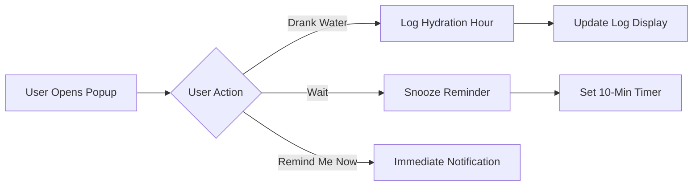

### Water Reminder Chrome Extension

#### Overview
The **Water Reminder** Chrome extension is a simple tool designed to help you stay hydrated by reminding you to drink water at regular intervals. It tracks your hydration progress throughout the day and includes snoozing functionality for reminders.

#### Features
- Hourly reminders to drink water.
- Daily hydration log to track progress.
- Buttons to log hydration or snooze reminders.
- Visual progress tracker for hydration goals.
- Manual hydration reminder option.

#### Installation
1. Clone or download the project files.
2. Open Chrome and navigate to `chrome://extensions`.
3. Enable **Developer Mode**.
4. Click **Load unpacked** and select the folder containing the project files.
5. The extension will appear in the extensions bar.

#### Usage
1. Click on the extension icon in the toolbar to open the popup.
2. Use the following buttons:
   - **"Drank Water" (Yes):** Log hydration for the current hour.
   - **"Wait":** Snooze the reminder for 10 minutes.
   - **"Remind Me Now":** Trigger an immediate hydration reminder.
3. View your daily progress in the hydration log section.

#### How It Works

#### File Structure
- `background.js`: Handles the countdown timer, notifications, and snoozing functionality.
- `popup.js`: Manages user interactions in the popup and updates the hydration log.
- `popup.html`: Defines the user interface for the extension popup.
- `manifest.json`: Metadata and permissions for the Chrome extension.
- Icons (`icon16.png`, `icon48.png`, `icon128.png`): Icons used for the extension at various resolutions.

#### Future Improvements
- Customizable reminder intervals.
- Gamified elements like achievements and badges.
- Weekly and monthly hydration analytics.
- Integration with smartwatches and mobile devices.

#### License
This project is licensed under the MIT License. Feel free to use and modify as needed.

---

Start staying hydrated and tracking your progress today with the Water Reminder Chrome Extension!

